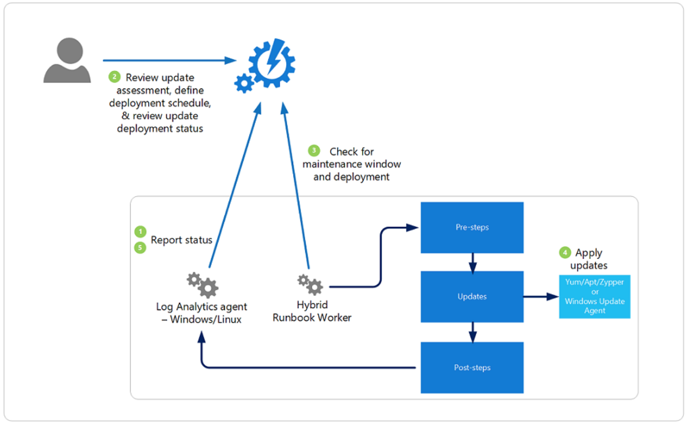

# AZ-500-Microsoft-Azure-Security-Technologies

## Session 1
### Topics
*Identity and Access*: 
Azure AD, Users and Groups, Azure AD Roles, MFA, SSPR, App registration, Azure AD custom domains, Azure AD Connect.

### Summary
- AAD : Azure Active Directory is an identity service.
- Identity: AAD account, AAD tenant, AAD subscription.
- https (web-based service through REST-API): 
  - oAuth
  - OpenID
  - SAML
  - Catalogue (flat)
  - No OU (Organizational Unit)
  - No GPO (Group Policy Object)
  - No LDAP (Lightweight Directory Access Protocol)
  - No Kerberos
  - No NTLM (New Technology LAN Manager)
- Authentication ruled via 
  - User catalogue
  - MFA
  - Self-Service Password Reset
  - Conditional Access Policies.
  
https://azure.microsoft.com/en-us/pricing/details/active-directory
|   |**FREE**   | **OFFICE 365 APPS**  |**PREMIUM P1**   |**PREMIUM P2**   |
|---|---|---|---|---|
| **Core Identity and Access Management**  |   |   |   |   |
| Directory Objects	| 500,000 Object Limit	| No Object Limit	| No Object Limit	| No Object Limit  |
| Single Sign-On (SSO)  | <ul><li> [x] </li></ul>|<ul><li> [x] </li></ul>|<ul><li> [x] </li></ul>|<ul><li> [x] </li></ul>|
|User provisioning |<ul><li> [x] </li></ul> |<ul><li> [x] </li></ul> |<ul><li> [x] </li></ul> |<ul><li> [x] </li></ul>
|Federated Authentication (ADFS or 3rd party IDP) |<ul><li> [x] </li></ul> |<ul><li> [x] </li></ul> |<ul><li> [x] </li></ul> |<ul><li> [x] </li></ul>
|User and group management (add/update/delete) |<ul><li> [x] </li></ul> |<ul><li> [x] </li></ul> |<ul><li> [x] </li></ul> |<ul><li> [x] </li></ul>
|Device registration |<ul><li> [x] </li></ul> |<ul><li> [x] </li></ul> |<ul><li> [x] </li></ul> |<ul><li> [x] </li></ul>
|Cloud Authentication (Pass-Through Auth, Password Hash sync, Seamless SSO) |<ul><li> [x] </li></ul> |<ul><li> [x] </li></ul> |<ul><li> [x] </li></ul> |<ul><li> [x] </li></ul>
|Azure AD Connect sync (extend on-premises directories to Azure AD) |<ul><li> [x] </li></ul> |<ul><li> [x] </li></ul> |<ul><li> [x] </li></ul> |<ul><li> [x] </li></ul>
|Self-Service Password Change for cloud users |<ul><li> [x] </li></ul> |<ul><li> [x] </li></ul> |<ul><li> [x] </li></ul> |<ul><li> [x] </li></ul>
|Azure AD Join: desktop SSO & administrator bitlocker recovery |<ul><li> [x] </li></ul> |<ul><li> [x] </li></ul> |<ul><li> [x] </li></ul> |<ul><li> [x] </li></ul>
|Password Protection (global banned password) |<ul><li> [x] </li></ul> |<ul><li> [x] </li></ul> |<ul><li> [x] </li></ul> |<ul><li> [x] </li></ul>
|Multi-Factor Authentication3 |<ul><li> [x] </li></ul> |<ul><li> [x] </li></ul> |<ul><li> [x] </li></ul> |<ul><li> [x] </li></ul>
|Basic security and usage reports |<ul><li> [x] </li></ul> |<ul><li> [x] </li></ul> |<ul><li> [x] </li></ul> |<ul><li> [x] </li></ul>
|**Business to Business Collaboration** | | | |
|Azure AD features for guest users |<ul><li> [x] </li></ul> |<ul><li> [x] </li></ul> |<ul><li> [x] </li></ul> |<ul><li> [x] </li></ul>
|**Identity & Access Management for Office 365 apps** | | | |
|Company branding (customization of logon & logout pages, access panel) |NA |<ul><li> [x] </li></ul> |<ul><li> [x] </li></ul> |<ul><li> [x] </li></ul>
|Self-service password reset for cloud users |NA |<ul><li> [x] </li></ul> |<ul><li> [x] </li></ul> |<ul><li> [x] </li></ul>
|Service Level Agreement (SLA) |NA |<ul><li> [x] </li></ul> |<ul><li> [x] </li></ul> |<ul><li> [x] </li></ul>
|Device write-back (device objects two-way synchronization between on-premises directories and Azure) |NA |<ul><li> [x] </li></ul> |<ul><li> [x] </li></ul> |<ul><li> [x] </li></ul>
|**Premium Features** | | | |
|Password Protection (custom banned password) |NA |NA |<ul><li> [x] </li></ul> |<ul><li> [x] </li></ul>
|Password Protection for Windows Server Active Directory (global & custom banned password) |NA |NA |<ul><li> [x] </li></ul> |<ul><li> [x] </li></ul>
|Self-service password reset/change/unlock with on-premises write-back |NA |NA |<ul><li> [x] </li></ul> |<ul><li> [x] </li></ul>
|Group access management |NA |NA |<ul><li> [x] </li></ul> |<ul><li> [x] </li></ul>
|Microsoft Cloud App Discovery5 |NA |NA |<ul><li> [x] </li></ul> |<ul><li> [x] </li></ul>
|Azure AD Join: MDM auto enrollment & local admin policy customization |NA |NA |<ul><li> [x] </li></ul> |<ul><li> [x] </li></ul>
|Azure AD Join: self-service bitlocker recovery, enterprise state roaming |NA |NA |<ul><li> [x] </li></ul> |<ul><li> [x] </li></ul>
|Advanced security and usage reports |NA |NA |<ul><li> [x] </li></ul> |<ul><li> [x] </li></ul>
|**Hybrid Identities** | | | |
|Application Proxy |NA |NA |<ul><li> [x] </li></ul> |<ul><li> [x] </li></ul>
|Microsoft Identity Manager user CAL |NA |NA |<ul><li> [x] </li></ul> |<ul><li> [x] </li></ul>
|Connect Health |NA |NA |<ul><li> [x] </li></ul> |<ul><li> [x] </li></ul>
|**Advanced Group Access Management** | | | |
|Dynamic groups |NA |NA |<ul><li> [x] </li></ul> |<ul><li> [x] </li></ul>
|Group creation permission delegation |NA |NA |<ul><li> [x] </li></ul> |<ul><li> [x] </li></ul>
|Group naming policy |NA |NA |<ul><li> [x] </li></ul> |<ul><li> [x] </li></ul>
|Group expiration |NA |NA |<ul><li> [x] </li></ul> |<ul><li> [x] </li></ul>
|Usage guidelines |NA |NA |<ul><li> [x] </li></ul> |<ul><li> [x] </li></ul>
|Default classification |NA |NA |<ul><li> [x] </li></ul> |<ul><li> [x] </li></ul>
|**Conditional Access** | | | |
|Conditional Access based on group, location, and device status |NA |NA |<ul><li> [x] </li></ul> |<ul><li> [x] </li></ul>
|Azure Information Protection integration |NA |NA |<ul><li> [x] </li></ul> |<ul><li> [x] </li></ul>
|SharePoint limited access |NA |NA |<ul><li> [x] </li></ul> |<ul><li> [x] </li></ul>
|Terms of Use (set up terms of use for specific access) |NA |NA |<ul><li> [x] </li></ul> |<ul><li> [x] </li></ul>
|Multi-Factor Authentication with Conditional Access |NA |NA |<ul><li> [x] </li></ul> |<ul><li> [x] </li></ul>
|Microsoft Cloud App Security integration |NA |NA |<ul><li> [x] </li></ul> |<ul><li> [x] </li></ul>
|3rd party identity governance partners integration |NA |NA |<ul><li> [x] </li></ul> |<ul><li> [x] </li></ul>
|**Identity Protection** | | | |
|Vulnerabilities and risky accounts detection |NA |NA |NA |<ul><li> [x] </li></ul>
|Risk events investigation |NA |NA |NA |<ul><li> [x] </li></ul>
|Risk based Conditional Access policies |NA |NA |NA |<ul><li> [x] </li></ul>
|**Identity Governance** | | | |
|Privileged Identity Management (PIM) |NA |NA |NA |<ul><li> [x] </li></ul>
|Access Reviews |NA |NA |NA |<ul><li> [x] </li></ul>
|Entitlement Management |NA |NA |NA |<ul><li> [x] </li></ul>
|---|---|---|---|---|
|**Price** |Free |O365 E1, E3, E5, F1, F3 |$6 user/month |$9 user/month


User:
- *Guest* - Microsoft Account (no MFA)
- *Member* - Azure Active Directory
- *synchronized* - Windows Server Active Directory.

add massive amount of users:
- use Az-User cmdlet with .csv

*Manage Security defaults* has to be set to False if you use *Conditional Access*.

New Group -> Membership type.
If someone moves department, should lose permissions -> dynamic user in Azure AD Premium P2.

*Azure Active Directory* is used to manage
- Users
- Groups
- Roles

*Subscription* 
- is linked to AAD 
- you cannot have a subscription without AAD but the opposite is possible.
- The licenses of the subscription are not coupled to AAD.
- do not use AAD Roles inside Subscription.


### Reading
1. Student Handbook: “Module 1 – Manage Identity and Access”. 
2. Azure AD official documentation: https://docs.microsoft.com/en-us/azure/active-directory/ 
3. Azure Identity best practices official documentation: https://docs.microsoft.com/en-us/azure/security/fundamentals/identity-management-best-practices

### Labs
- https://github.com/MicrosoftLearning/AZ-500-Azure-Security/blob/master/Instructions/Labs/Module_1/LAB_03_MFA.md 
- https://github.com/MicrosoftLearning/AZ-500-Azure-Security/blob/master/Instructions/Labs/Module_1/LAB_04_App_Registration.md 
- https://github.com/MicrosoftLearning/AZ-500-Azure-Security/blob/master/Instructions/Labs/Module_1/LAB_05_Application_Service_Principal.md 
- https://github.com/MicrosoftLearning/AZ-500-Azure-Security/blob/master/Instructions/Labs/Module_1/LAB_06_RBAC.md 
- https://docs.microsoft.com/en-us/azure/active-directory/active-directory-groups-members-azure-portal 
- https://docs.microsoft.com/en-us/azure/active-directory/active-directory-groups-create-azure-portal 
- https://docs.microsoft.com/en-us/azure/active-directory/active-directory-users-profile-azure-portal 

## Session 2
### Topics
*Identity and Access*: 
RBAC, Azure AD Privileged Identity Management, Identity Protection, Switch tenant. 
 
*Platform protection*: 
Shared responsibility model, Virtual Networks and subnets, Virtual Network Gateway, Load Balancer, Traffic Manager. 

### Summary
1 subscription belongs to only one tenant.
Azure AD is an authentication service, it is an identity provider and authenticator for subscriptions. The Azure Resource Manager "connects" AAD to the individual subscriptions.
RBAC: https://docs.microsoft.com/en-us/azure/role-based-access-control/overview
Service Principal comes from AAD.
Scope -> roles are inherited:
- If someone Reader on Management Group and Contributor on Subscription, then also Contributor on Resource in that Subscription.
- Deny access is highest priority.
non-service oriented roles:
- Owner
- Contributor 
- Reader
To see other roles, e.g. Roles > Virtual Machine Contributor > Permissions.
```powershell
help *-AzRole*
Get-AzRoleDefinition -Name Owner
Get-AzRoleDefinition | Select Name
Get-AzRoleDefinition -Name "Virtual Machine Contributor" | ConvertTo-JSON
```
Custom Role Definitions

#### Azure AD Privileged Identity Management (PIM)
- assignment for particular time
- access reviews -> signed
- Azure AD Roles - authorization to manage services
- Azure Subscription - RBAC roles give authorization to manage ressources 
- JIT gives just-in-time access to managing AAD Roles and RBAC roles.
- assignment is always for a particular time
- first Global Administrator that has enabled PIM is the only one who can manage PIM.
- Others need to have to have Role of *Privileged Role Administrator*
- only works for Premium P2 licenses.

assignment:
- eligible: role assigned but access not activated.
- active: role is active right now.

Account Admin is Billing Owner. Change Billing Owner by *Transfer Billing Ownership*.

#### Azure Identity Protection
Risk classification:
- Sign-In risk:
  - anonymous IP address
- User risk:
  - leaked credentials
  
Risk level:
- low
- medium
- high

#### Application proxy
- registered in App registration
- add platform redirect URIs
- loop: AAD connector service to Web and from Web via URL App Proxy back to AAD
- Branding Enterprise Applications Assign Users and Groups

Glossary: https://docs.microsoft.com/en-us/azure/active-directory/develop/developer-glossary#security-token

Overview of Microsoft Authentication Library (abbreviated as MSAL):
- ADAL -> v1.0 endpoint
- MSAL -> v2.0 endpoint

- Application types for Microsoft identity platform
- JWT tokens

#### Conditional access policies
Security -> Conditional access policies:
https://docs.microsoft.com/en-us/azure/active-directory/conditional-access/overview
Named Location
- IP ranges
- Policies
Signal:
- everything that signifies activity.
- Users
- Location
- IP address
Condition:
- checks signal, triggers control mechanism
Control:
- block or grant access (control block)

#### MFA (Multi-factor authentication)
More than one verification method:
- username and password
- SMS
- Phone call
- Authenticator app
- etc.
MFA Registration
Good practice: Admins should also have MFA.

#### Self-Service Password Reset (SSPR)
- AAD to on-prem ADDS is per-se one-way connection, so no way to reset password in Cloud
  - Use Write Back Configured in AD Connect.
- Synchronize on-prem ADDS with AAD via ADConnect
- aka.ms/sspr

#### Single Sign-On (SSO)
- not re-enter credentials

#### Sychronization Methods
https://docs.microsoft.com/en-us/microsoft-365/education/deploy/aad-connect-and-adfs
1. Password Hash Synchronization:
   - recommended
2. Pass-Through Synchronization:
  - only Identity without password
  - needs on-prem ADDS
3. AD FS Synchronization
  - FS: Federation Services
  
AAD -> Global Administrator role
ADDS -> Enterprise Admin

#### Application Gateway
- OSI Level 7 load balancing
- http/https requests

#### Web Application Firewall (WAF)
- security checks on incoming traffic based on OWASP recommendations

#### Traffic Manager
- load balancer for DNS requests
- e.g. closest website e.g. choose between EU and US region for a certain user.


### Reading
1. Student Handbook: “Module 2 – Implement Platform Protection” => “Understand cloud security”, 
“Implement network security” 
2. Azure AD PIM official documentation: https://docs.microsoft.com/en-us/azure/active-directory/privileged-identity-management/pim-configure 
3. Azure Virtual Networking official documentation: https://docs.microsoft.com/en-us/azure/virtual-network/  
4. Azure Virtual Networking security best practices official documentation: https://docs.microsoft.com/en-us/azure/security/fundamentals/network-best-practices

### Labs
- https://github.com/MicrosoftLearning/AZ-500-Azure-Security/blob/master/Instructions/Labs/Module_1/LAB_01_PIM.md 
- https://github.com/MicrosoftLearning/AZ-500-Azure-Security/blob/master/Instructions/Labs/Module_1/LAB_09_Subscriptions.md 
- https://github.com/MicrosoftLearning/AZ-500-Azure-Security/blob/master/Instructions/Labs/Module_2/LAB_04_Create%20a%20VNet.md 
- https://github.com/MicrosoftLearning/AZ-500-Azure-Security/blob/master/Instructions/Labs/Module_2/LAB_10_Load%20Balancer%20and%20App%20Gateway.md 
- https://github.com/MicrosoftLearning/AZ-500-Azure-Security/blob/master/Instructions/Labs/Module_2/LAB_08_VNet%20Peering.md 
- https://github.com/MicrosoftLearning/AZ-500-Azure-Security/blob/master/Instructions/Labs/Module_2/LAB_18_Custom%20Domains.md 
- https://github.com/MicrosoftLearning/AZ-500-Azure-Security/blob/master/Instructions/Labs/Module_2/LAB_09_Azure%20DNS.md 
- https://github.com/MicrosoftLearning/AZ-500-Azure-Security/blob/master/Instructions/Labs/Module_2/LAB_19_Private%20DNS.md 

## Session 3
### Topics
*Platform protection*: 
Network Security Groups, NVA, forced tunneling, UDR, Azure Firewall, DDoS protection.  
VM Security: Admin access.

### Summary
#### Networking
- CIDR notation: https://www.digitalocean.com/community/tutorials/understanding-ip-addresses-subnets-and-cidr-notation-for-networking.
- Virtual Networks: https://docs.microsoft.com/en-us/azure/virtual-network/security-overview
IP address space, e.g. 10.10.0/16 -> subnet e.g. 10.10.1.0/24: CIDR IP subnet masks follow IPv4 protocol.
Virtual Net with same space of IP addresses will not be connected to outside.
IP address spaces for each subnet should be different, as networks with same IP address space cannouted be routed together.
Subnets inside a VNet are interconnected by system routes.
IP addresses:
- private always with VNets (dynamic or static)
- public: dynamic or static. For production has to be static.
Connection possibilites:
- VNet-2-VNet
- VPN connection using VPN Gateways
- Site-2-Site via IPSec tunnel
- VNet peering: 
  - more secure because it goes through Microsoft network backbone infrastracture.
  - allows to connect globally (global VNet peering).
 
 Hub-and-spoke (STAR):
 - Hub: security appliance
   - on-prem can connect to Hub via Virtual Network Gateway on Hub.
 - Spoke: 
   - routed through hub
   - hub has peering to individual spokes, but the spokes are not peered by the default ("VNet peering is not transitive by default")
   
 Virtual Network Gateway:
 - site-to-site connection between VNets or VNet and Gateway.
 Connect on-prem to Virtual Network Gateway:
 1) Create VPN Gateway Subnet.
 2) Create VPN Gateway.
 3) Create Local Network Gateway
 4) Connect
 
 Tool for inspecting Network architecture on Azure: Network Watcher > Topology.
 ExpressRoute always runs over Microsoft device
 
 Load Balancer:
 - public: internet-facing
 - private: virtual subnet-facing
 - OSI level 4 that balances the requests on the front-end pool to the backend-pool, e.g. VMs.


#### Network Security Group
- simple packet filter and control
- 5-tuple rule:
  - Source IP address
  - Source Port
  - Destination IP
  - Destination Port
  - Protocol:
    - TCP
    - UDP
- Allow/Deny rules

Predefined default rules exist for inbound and outbound traffic. You can’t delete these rules, but you can override them, because they have the lowest priority. The default rules allow all inbound and outbound traffic within a virtual network, allow outbound traffic towards the internet, and allow inbound traffic to an Azure load balancer. A default rule with the lowest priority also exists in both the inbound and outbound sets of rules that denies all network communication.

priority:
- lowest number has highest priority

inbound traffic:
- first through Subnet and then through Network Interface Card
outbound traffic:
- first through Network Interface Card and then through Subnet
best practice:
assign NSG rules on Subnet level.

#### Application Security Group (ASG)
Network Virtual Appliance (NVA)
- typically set of VMs
- packet inspection filter

UDR
- user-defined routing
- routing table associated with particular subnet.

#### Azure Firewall
- stateful service
- less dummy than NSGs
- packet filter
- NVA for Routing
- automatically scalable enterprise-level service
- subnet has to be named *Azure Firewall Subnet* 
- similiar to Threat Management Gateway

Fully-Qualified Domain Names (FQDN):
- Target FQDNs e.g. *google.com

Distributed-Denial-of-Service (DDoS):
- Level 3 and 4 of OSI model
- Standard DDoS plan

https://www.ixiacom.com/products/breakingpoint_cloud

#### VM Security: Admin access
Why bad practice to expose RDP to public internet?
- prone to DDoS attack on level 3 or 4.

better practice: avoid public IP access assignment to VMs at all

Options to access VMs with private IP addresses
1) BASTION (encrypted-in-browser https session) - does not need public IP address (similar to Remote Stop Gateway Service)
2) connect via Jumphost/Jumpbox/Privileged access station VM inside Management Subnet with NSG available via Public IP address
3) DNAT with Firewall
4) Best practice: VPN Gateway on VNet (highly secure world)
   - connect on-prem network to VPN Gateway (via S-2-S (site-to-site))
   - connect from Home to on-prem via VPN (P-2-S (point-to-site))
   - connect from Home to Azure VNet directly also via P-2-S
5) ExpressRoute 
   - direct connection from on-prem to Azure.
   
specific Roles for VMs (Virtual Machine User Login, Virtual Machine Contributor, Virtual Machine Administrator Login)

VMs configure specificpublic Internet address on which you go out:
NAT Gateway:
- SNAT (Source Network Address Translation)
- assign on Subnet level inside VNet.

### Reading
1. Student Handbook: “Module 2 – Implement Platform Protection” => “Secure the network”, “Implement host security”  
2. Azure VMs security official documentation: https://docs.microsoft.com/en-us/azure/security/fundamentals/virtual-machines-overview 
3. Azure IaaS security best practices official documentation: https://docs.microsoft.com/en-us/azure/security/fundamentals/iaas 
4. Security recommendation for Azure Windows VMs official documentation: https://docs.microsoft.com/en-us/azure/virtual-machines/windows/security-recommendations

### Labs
- https://github.com/MicrosoftLearning/AZ-500-Azure-Security/blob/master/Instructions/Labs/Module_2/LAB_11_VPN%20Gateways%20and%20Tunnelling.md 
- https://github.com/MicrosoftLearning/AZ-500-Azure-Security/blob/master/Instructions/Labs/Module_2/LAB_05_NSGs.md 
- https://github.com/MicrosoftLearning/AZ-500-Azure-Security/blob/master/Instructions/Labs/Module_2/LAB_06_NVA.md 
- https://github.com/MicrosoftLearning/AZ-500-Azure-Security/blob/master/Instructions/Labs/Module_2/LAB_12_Azure%20Firewall.md 
- https://github.com/MicrosoftLearning/AZ-500-Azure-Security/blob/master/Instructions/Labs/Module_2/LAB_15_DDoS%20Protection.md 
- https://github.com/MicrosoftLearning/AZ-500-Azure-Security/blob/master/Instructions/Labs/Module_2/LAB_13_Secure%20Admin%20Access.md 
- https://github.com/MicrosoftLearning/AZ-500-Azure-Security/blob/master/Instructions/Labs/Module_2/LAB_14_Azure%20Bastion.md 
- https://github.com/MicrosoftLearning/AZ-500-Azure-Security/blob/master/Instructions/Labs/Module_2/LAB_16_Antimalware.md 
- https://github.com/MicrosoftLearning/AZ-500-Azure-Security/blob/master/Instructions/Labs/Module_2/LAB_17_Update%20Management.md 

## Session 4
### Topics
*Platform protection*: 
VM Security: Antimalware, Security Center, Updates, Availability Set.  
Management Groups, Azure Resource Manager, locks, Azure Policy.

### Summary
#### VM-Security: Availability Set
datacenter:
- has multiple server racks
- each server rack is a so-called *fault domain*
- each server contains update-domains

availability zone:
- 2-3 datacenters in a certain region that are high-speed (via optical fibers) interconnected.

availability set:
- Your VM would be spread across update and fault domains but it could happen that your Azure VM is running within the sam datacenter (e.g. same building).


#### VM-Security: Azure Security Center
- scans Azure subscription resources by default
- deploys Azure Policy on subscriptions which in turn triggers a *Detect-Prevent-Alert* mechanism
- Pricing and settings:
  - Free
  - Standard: protect and alert.

#### VM-Security: Antimalware
Cloud has shared responsibility model, but Azure has Antimalware solutions.

#### VM-Security: Updates
Native to Azure: Update Management solution
Machines that are managed by Update Management use the following configurations to perform assessment and to update deployments:

- Log Analytics agent for Windows or Linux
- PowerShell Desired State Configuration (DSC) for Linux
- Automation Hybrid Runbook Worker (Automation Account)
- Microsoft Update or Windows Server Update Services (WSUS) for Windows machines

https://docs.microsoft.com/en-us/azure/automation/automation-update-management



#### VM-Security: Management group
- lets you group subscriptions
- you can have nested management groups
- you can have up to six levels of management groups
- Root Managemnet Group is created by default
- on level of management group you assign RBAC and Policies for Centralized management.


#### VM-Security: Azure Resource Manager (ARM)
- https://docs.microsoft.com/en-us/azure/azure-resource-manager/management/overview
- management layer for entire Azure infrastructure
- Requests by tools go to Azure Resource Manager that sends requests to Resource Provider e.g. for VMs Compute, Storage Storage Account, etc.
- AAD provides users, groups, principals  (identity for authentication)
- also acts as authorization service additionally to authentication. ARM checks RBAC assignments.
- additional features: 
  - Azure Policy
  - Azure Locks


#### VM-Security: locks
- https://docs.microsoft.com/en-us/azure/azure-resource-manager/management/lock-resources
- automatic inherits to down-side levels.
- can be assigned on subscription, resource group, resource
- has 2 lock actions
  - read-only
  - delete (does not prevent creation)
- roles that can create locks:
  - Owner
  - User Access Administrator


#### VM-Security: Azure Policy
- https://docs.microsoft.com/en-us/azure/governance/policy/overview
- https://docs.microsoft.com/en-us/azure/governance/policy/concepts/definition-structure
- assign on management group, subscription, resource group
- group policies to initiative
- under-the-hood just a JSON file (policy definition) with an if-then evaluation.
- Effect: what to do if policy not met, e.g. audit (send message to portal dashboard) or deny.
  - https://docs.microsoft.com/en-us/azure/governance/policy/concepts/effects
  - be careful with *DeployIfNotExists*
2 options:
- 1. Evaluation: scheduled every hour.
- 2. Check on the ARM call


### Reading
1. Student Handbook: “Module 2 – Implement Platform Protection” => “Configure security policies by using Microsoft Azure Security Center”, “Implement subscription security”  
2. Azure Windows VM availability sets official documentation: https://docs.microsoft.com/en-us/azure/virtual-machines/windows/manage-availability 
3. Azure Container instances security official documentation: https://docs.microsoft.com/en-us/azure/container-instances/container-instances-image-security 
4. Azure Policy official documentation: https://docs.microsoft.com/en-us/azure/governance/policy/overview 

### Labs
- https://github.com/MicrosoftLearning/AZ-500-Azure-Security/blob/master/Instructions/Labs/Module_2/LAB_02_Function%20Apps.md 
- https://github.com/MicrosoftLearning/AZ-500-Azure-Security/blob/master/Instructions/Labs/Module_1/LAB_08_Azure_Locks.md 
- https://github.com/MicrosoftLearning/AZ-500-Azure-Security/blob/master/Instructions/Labs/Module_1/LAB_07_Azure_Policy.md 
- https://github.com/MicrosoftLearning/AZ-500-Azure-Security/blob/master/Instructions/Labs/Module_2/LAB_20_Azure%20Blueprints.md 
- https://github.com/MicrosoftLearning/AZ-500-Azure-Security/blob/master/Instructions/Labs/Module_2/LAB_03_Create%20a%20Kubernetes%20Cluster.md 

## Session 5
### Topics
*Security operations*: 
Serverless apps and containers security (Continue). 

Azure Monitor, Log Analytics, Alerts, diagnostic logging. 

### Summary
Serverless: 
- develop certain type of code (options: Functions, Logic Apps) and run code with trigger executed on an execution environment (typically application services). You do not care about execution environment.
functions should not run too long.
- Possible Plan types:
  - Consumption (Serverless)
  - Premium
  - App Service Plan
- Pricing Tier:
  - Dynamic
  - Free
- you can set:
  - can be code or Docker container
  - Runtime stack
  - Version
  - Region
  - either Linux or Windows OS
  - Application Insights Monitoring

Durable Functions: https://docs.microsoft.com/en-us/azure/azure-functions/durable/durable-functions-overview?tabs=csharp

Security Considerations (similar to Web App because underlying platform is App Service):
- Deployment Center to deploy functions 
- Deployment slots
- Configuration:
  - Application settings
  - Function runtime settings
  - General settings: 
    - *Always on* is disabled for free tier - only enabled on Standard S1 tier.
- Authentication / Authorization: App Service Authentication can be turn to *On* and then choose authentication provider such as Azure AAD.
- Backups can be enabled
  - Snapshots require a Premium App Service plan
  - backup need minimally Standard S1 plan - can be one-time or scheduled backups.
- Custom domains:
  - you should not use generic Microsoft URL *.azurewebsites.net*, but custom enterprise domains
  - need D1 plan if Dev/Test, otherwise for production minimally S1.
  - you can use SSL configuration and manual scaling and more powerful VM for B1 plan in Dev/Test, otherwise S1 for production
- TLS/SSL settings:
  - *HTTPS only* is by default disabled, i.e. HTTP also allowed
  - *Minimum TLS Version* by default is 1.2.
  - you can upload Private KEy Certifcates (.pfx) or Create App Service Managed Certificate and then you can add TLS/SLL binding. 
  - you can upload Public Key Certificate
- Networking:
  - VNet Integration
    - you can use Function or Web App with VNet Integration 
    - only outbound connection, so you can connect Function or Web App to VNet - from VNet to Function/WebApp is not available
  - hybrid connection
    - you can configure IP port connections (tunneling) 
    - Point-to-Point Connection
- API Management:
  - API: subset of functions based on Application Services
  - hide underlying APIs (backend) behind one big API proxy (frontend)
  - just URL of API Management and through slash you connect to particular APIs e.g. Function Apps, Container Services, Web Apps.
  - you can enable Azure AD Authentication on API Management level.
- API:
  - frontend configuration
  - inbound processing: request to backend
    - you can configure policies. -> you can use show snippets
  - backend: http(s) endpoint.
  - outbound processing: modify response before it is sent to the client
    - you can configure policies. -> you can use show snippets
- Scale up (vertical scaling)
  - increase power of VM
  - dev/test, production and isolated environments
- Scale out (horizontal scaling)
  - increases copies of VM

#### Container security
Azure Container Registry (ACR):
- repository for docker container images
- Access Control (IAM) > Role assignments:
  - service-specific roles are AcrDelete, AcrPull, AcrPush, AcrImageSigner etc.
- Encryption > Customer-managed keys
- Networking > (Endpoints / PaaS Firewalls)
- Replications
  - motivation: high availability and you can spread load for your registries
- Policies > Content Trust:
  - if enabled you can push signed and trusted containers
  - needs Premium tier for this registry
- Security Center > Pricing and Settings > Pricing tier (Standard):
  - enable Container Registries checks vulnerabilities

Azure Kubernetes Service (AKS):
- https://docs.microsoft.com/en-us/azure/security-center/container-security
- https://docs.microsoft.com/en-us/azure/container-instances/container-instances-image-security
- https://azure.microsoft.com/de-de/resources/container-security-in-microsoft-azure/
- https://docs.microsoft.com/en-us/azure/security-center/monitor-container-security
- https://docs.microsoft.com/en-us/azure/aks/use-network-policies
- Networking: https://docs.microsoft.com/en-us/azure/aks/use-network-policies
- Managed K8s (you do not pay for this)
- connect via public API URL (via kubectl) to Managed K8s
- Managed K8s manages pool of hosts in which you run containers called *pod* (automatic scheduling).
- To connect privately, there is an option:
  - https://docs.microsoft.com/en-us/azure/aks/private-clusters
- Access via Azure AD:
  - https://docs.microsoft.com/en-us/azure/aks/azure-ad-integration
  - `powershell az aks get-credentials --resource-group myResourceGroup --name myAKSCluster --admin`
  - Assign AAD Identity to K8s (Kubernetes) platform and use own RBAC:
    - create role
    - create role binding
    - https://docs.microsoft.com/en-us/azure/aks/azure-ad-rbac?toc=https%3A%2F%2Fdocs.microsoft.com%2Fen-us%2Fazure%2Faks%2Ftoc.json&bc=https%3A%2F%2Fdocs.microsoft.com%2Fen-us%2Fazure%2Fbread%2Ftoc.json
  
#### Azure Monitor
Set of services based on 3 databases (where data is stored: STORE):
- Activity Log
- Metrics
  - value at particular point in time
  - can be grabbed from Azure Resources (platform-level), Custom Metrics (have to be tied to particular Azure resource)
  - supports up to 90 days of retention of metrics from your Resources
  - almost real-time (each metric is ingested in 1-3 minutes)
  - you can use them for:
    - Metric Explorer called *Metrics*
    - you can run Alerts on top of these metrics
    - Azure Portal Dashboards 
  - (can also be connected to Grafana)
- Logs
  - behind the scenes *Log Analytics Workspace*
  - Log Analytics Workspaces
  - you can use KQL (Keyword Query Language) to get data
  - you can create Alerts, Dashboards
  
You can send Custom Logs to Log Analytics Workspace (performance counters and metrics will also be stored as logs) via Microsoft Monitoring Agent (MMA).
  
Insights builds on top of the Logs and Metrics.
Security Center works on top of Log Analytics Workspace.
Azure Sentinel (SIEM) on top of Log Analytics Workspace:
- https://docs.microsoft.com/en-us/azure/sentinel/overview
Log Analytics Workspace is not created by default.

#### Log Analytics Workspace (LAW)


#### Diagnostic settings


### Reading
1. Student Handbook: “Module 3 – Manage Security Operations” => “Configure security services”, “Configure security policies by using Microsoft Azure Security Center”  
2. Azure Monitor official documentation: https://docs.microsoft.com/en-us/azure/azure-monitor/overview 

3. Azure Security Center official documentation: https://docs.microsoft.com/en-us/azure/security-center/security-center-intro 

4. Azure Operational Security best practices official documentation: https://docs.microsoft.com/en-us/azure/security/fundamentals/operational-best-practices
### Labs
- https://github.com/MicrosoftLearning/AZ-500-Azure-Security/blob/master/Instructions/Labs/Module_4/LAB_01_Azure%20Monitor.md 
- https://github.com/MicrosoftLearning/AZ-500-Azure-Security/blob/master/Instructions/Labs/Module_4/LAB_02_Security%20Center.md 
- https://github.com/MicrosoftLearning/AZ-500-Azure-Security/blob/master/Instructions/Labs/Module_4/LAB_07_Secure%20score%20in%20Azure%20Security%20Center.md 
- https://github.com/MicrosoftLearning/AZ-500-Azure-Security/blob/master/Instructions/Labs/Module_4/LAB_05_Manage%20endpoint%20protection%20issues.md 
- https://github.com/MicrosoftLearning/AZ-500-Azure-Security/blob/master/Instructions/Labs/Module_2/LAB_01_Monitor%20%26%20Autoscale.md 
- https://github.com/MicrosoftLearning/AZ-500-Azure-Security/blob/master/Instructions/Labs/Module_4/LAB_09_JIT.md 
- https://github.com/MicrosoftLearning/AZ-500-Azure-Security/blob/master/Instructions/Labs/Module_4/LAB_04_Azure%20Sentinel.md 
- https://github.com/MicrosoftLearning/AZ-500-Azure-Security/blob/master/Instructions/Labs/Module_4/LAB_06_Security%20Playbook%20in%20Azure%20Sentinel.md 

## Session 6
### Topics
*Security operations*: 
Security alerts, security baseline. 

*Secure data and applications*: 
Data classification, Azure SQL firewall, Azure SQL Database Advanced Data Security, SAS. 

### Reading
1. Student Handbook: “Module 3 – Manage Security Operations” => “Manage security alerts”, “Respond to and remediate security issues”, “Create security baselines” 
2. Student Handbook: “Module 4 – Secure Data and Applications” => “Configure security policies to manage data”, “Configure security for data infrastructure” 
3. Azure SQL data classification official documentation: https://docs.microsoft.com/en-us/azure/sql-database/sql-database-data-discovery-and-classification 
4. Azure SQL Advanced Data Security official documentation: https://docs.microsoft.com/en-us/azure/sql-database/sql-database-advanced-data-security 
5. Storage Access Signatures (SAS) official documentation: https://docs.microsoft.com/en-us/azure/storage/common/storage-sas-overview 
6. Azure Security Alerts official documentation: https://docs.microsoft.com/en-us/azure/security-center/security-center-alerts-overview

### Labs
- https://github.com/MicrosoftLearning/AZ-500-Azure-Security/blob/master/Instructions/Labs/Module_4/LAB_08_Create%20security%20baselines.md 
- https://github.com/MicrosoftLearning/AZ-500-Azure-Security/blob/master/Instructions/Labs/Module_3/LAB_01_Classify%20a%20SQL%20Database.md 
- https://github.com/MicrosoftLearning/AZ-500-Azure-Security/blob/master/Instructions/Labs/Module_3/LAB_02_Auditing%20a%20Database.md 
- https://github.com/MicrosoftLearning/AZ-500-Azure-Security/blob/master/Instructions/Labs/Module_3/LAB_03_Analyze%20audit%20logs%20and%20reports.md 

## Session 7
### Topics
*Secure data and applications*: 
Azure SQL Database Always Encrypted, Storage encryption, Azure Disk encryption, Azure Backup encryption, Web App for containers, Application Insights, Microsoft Security Development Lifecycle.
### Reading
1. Student Handbook: “Module 4 – Secure Data and Applications” => “Configure encryption for data at rest”, “Understand application security”, “Implement security for application lifecycle” 
2. Azure Disk Encryption official documentation: https://docs.microsoft.com/en-us/azure/security/fundamentals/azure-disk-encryption-vms-vmss 
3. Azure SQL Database Always Encrypted official documentation: https://docs.microsoft.com/en-us/sql/relational-databases/security/encryption/always-encrypted-database-engine?redirectedfrom=MSDN&view=sql-server-ver15 
4. Azure Application Security (Azure Architecture Framework) official documentation: https://docs.microsoft.com/en-us/azure/architecture/framework/security/applications-services 
5. Azure Application secure development and lifecycle management official documentation: https://docs.microsoft.com/en-us/azure/security/develop/secure-dev-overview 
### Labs
- https://docs.microsoft.com/en-us/azure/virtual-machines/windows/disk-encryption-portal-quickstart 
- https://docs.microsoft.com/en-us/azure/storage/common/storage-encryption-keys-portal 

## Session 8
### Topics
*Secure data and applications*: 
Managed Identity, PaaS firewall and Service Endpoint, Front Door, Key Vault 
### Reading
1. Student Handbook: “Module 4 – Secure Data and Applications” => “Secure applications”, “Configure and manage Microsoft Azure Key Vault” 
2. Azure Network Service Endpoint official documentation: https://docs.microsoft.com/en-us/azure/virtual-network/virtual-network-service-endpoints-overview 
3. Azure Front Door official documentation: https://docs.microsoft.com/en-us/azure/frontdoor/front-door-overview 
4. Azure Key Vault official documentation: https://docs.microsoft.com/en-us/azure/key-vault/general/overview
### Labs
- https://github.com/MicrosoftLearning/AZ-500-Azure-Security/blob/master/Instructions/Labs/Module_1/LAB_02_Key_Vault.md 
- https://docs.microsoft.com/en-us/azure/virtual-network/tutorial-restrict-network-access-to-resources 
- https://docs.microsoft.com/en-us/azure/frontdoor/quickstart-create-front-door 
